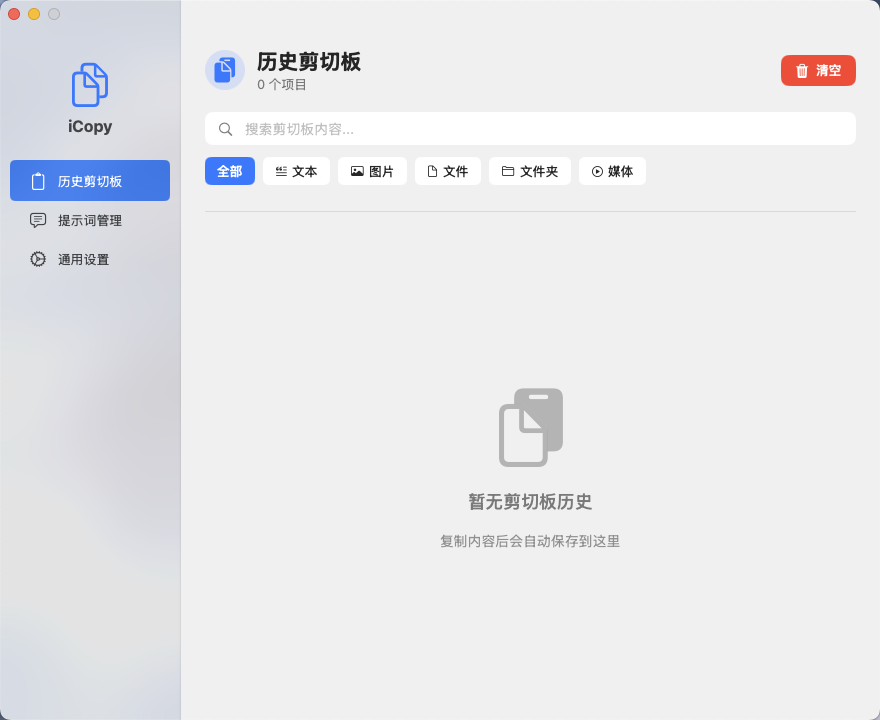

# iCopy - 智能剪贴板与提示词管理工具

[](https://www.apple.com/macos/)
[](https://swift.org/)
[](LICENSE)

<p align="center">
  
</p>

## 📖 项目简介

iCopy 是一个功能强大的 macOS 应用，集成了**剪贴板历史管理**和 **AI 提示词管理**功能，帮助您更高效地使用大语言模型和管理日常复制内容。采用现代化的 SwiftUI 设计，界面简洁优雅，符合 macOS 设计规范。



### ✨ 核心功能

#### 📋 剪贴板管理
- 🔄 **自动记录**：实时监控并保存所有复制内容
- 📦 **多类型支持**：文本、图片、文件、文件夹、媒体文件
- 🔍 **智能搜索**：快速搜索和过滤历史记录
- 🏷️ **类型筛选**：按内容类型快速筛选
- 👁️ **Quick Look 预览**：使用 macOS 原生预览功能查看内容
- 🎨 **缩略图显示**：所有类型内容都有直观的缩略图预览
- ⚙️ **灵活配置**：可配置最大历史记录数量和自动清理间隔
- ⏰ **智能清理**：自动清理过期记录，支持倒计时显示
- ⌨️ **全局快捷键**：随时随地快速调出历史记录选择器

#### 💬 提示词管理
- 📁 **分类管理**：自定义分类，灵活组织提示词
- ⭐ **收藏功能**：标记常用提示词，快速访问
- 🏷️ **标签系统**：多维度标签，精准定位
- 📝 **富文本编辑**：支持长文本提示词编辑
- 🔍 **全文搜索**：快速定位所需提示词
- 📋 **一键复制**：点击即可复制到剪贴板
- 👁️ **Quick Look 预览**：预览提示词完整内容
- ⌨️ **全局快捷键**：快速调出提示词选择器

## 🚀 快速开始

### 系统要求
- macOS 11.0 或更高版本
- Xcode 13.0 或更高版本（开发）

### 安装步骤

1. 克隆项目到本地
```bash
git clone https://github.com/yourusername/iCopy.git
cd iCopy
```

2. 使用 Xcode 打开项目
```bash
open iCopy.xcodeproj
```

3. 编译并运行
- 选择目标设备（Mac）
- 点击运行按钮或按 `Cmd + R`

### 首次使用配置

1. **授予权限**：首次启动时需要授予以下权限
   - **辅助功能权限**（必需）
     - 用途：监听全局快捷键和键盘事件
     - 设置路径：系统偏好设置 → 安全性与隐私 → 隐私 → 辅助功能
     - 应用会自动检测权限状态并在设置页面显示

   - **通知权限**（可选）
     - 用途：显示操作提示和通知
     - 设置路径：系统偏好设置 → 通知
     - 应用会自动检测权限状态并在设置页面显示

2. **配置快捷键**：在"通用设置"中自定义快捷键（支持实时编辑）
   - 打开应用：`Cmd + Shift + O`（默认）
   - 显示剪贴板：`Cmd + Shift + C`（默认）
   - 显示提示词：`Cmd + Shift + T`（默认）

3. **配置呼出位置**：选择弹窗显示位置
   - 屏幕顶部
   - 屏幕底部（默认）
   - 屏幕左侧
   - 屏幕右侧

4. **添加提示词**：进入"提示词管理"，创建您的第一个提示词和分类

## 📚 使用指南

### 剪贴板管理
1. 应用会自动记录您复制的所有内容
2. 按 `Cmd + Shift + C` 调出剪贴板历史选择器
3. 使用搜索框快速查找历史内容
4. 使用类型筛选按钮（全部/文本/图片/文件/文件夹/媒体）快速筛选
5. 点击"详情"按钮使用 Quick Look 预览内容
6. 点击"复制"按钮将内容复制到剪贴板
7. 点击"删除"按钮移除不需要的历史记录

### 提示词管理
1. 在侧边栏点击"提示词管理"进入管理界面
2. 点击"管理分组"按钮创建和管理分类
3. 点击"添加提示词"按钮创建新提示词
   - 填写标题和内容
   - 选择分类
   - 添加标签（可选）
   - 设置为收藏（可选）
4. 使用搜索框快速查找提示词
5. 使用分类筛选按钮快速定位
6. 点击"详情"按钮使用 Quick Look 预览完整内容
7. 点击"复制"按钮将提示词复制到剪贴板
8. 按 `Cmd + Shift + T` 快速调出提示词选择器

## 🏗️ 项目架构

### 技术栈
- **语言**：Swift 5.5+
- **UI 框架**：SwiftUI, AppKit
- **数据持久化**：Core Data
- **系统集成**：
  - NSPasteboard（剪贴板访问）
  - Accessibility APIs（全局快捷键）
  - Quick Look（文件预览）
  - UserNotifications（通知）
- **设计规范**：遵循 macOS Human Interface Guidelines

### 核心模块

项目采用模块化架构，按功能划分目录：

```
iCopy/
├── iCopyApp.swift              # 应用入口
├── ContentView.swift            # 主界面导航
│
├── Models/                     # 数据模型层
│   ├── ClipboardHistory.xcdatamodeld/  # Core Data 模型
│   ├── ClipboardType.swift     # 剪贴板类型枚举
│   └── PersistenceController.swift     # 数据持久化控制器
│
├── Features/                   # 功能模块
│   ├── Clipboard/              # 剪贴板功能
│   │   ├── HistoryClipboardView.swift      # 历史记录主界面
│   │   ├── ClipboardItemCard.swift         # 剪贴板卡片组件
│   │   ├── ClipboardPickerView.swift       # 快捷选择器弹窗
│   │   └── ClipboardPickerCardView.swift   # 选择器卡片组件
│   ├── Prompt/                 # 提示词功能
│   │   ├── PromptManagementView.swift      # 提示词管理主界面
│   │   ├── PromptEditorView.swift          # 提示词编辑器
│   │   ├── PromptCardView.swift            # 提示词卡片组件
│   │   ├── PromptPickerView.swift          # 快捷选择器弹窗
│   │   ├── PromptPickerCardView.swift      # 选择器卡片组件
│   │   └── CategoryManagementView.swift    # 分类管理界面
│   └── Settings/               # 设置功能
│       └── SettingsView.swift              # 通用设置界面
│
├── Utils/                      # 工具类
│   ├── ClipboardCleanupManager.swift   # 剪贴板自动清理管理
│   ├── QuickLookManager.swift          # Quick Look 预览管理
│   ├── WindowManager.swift             # 窗口管理
│   ├── KeyEventHandlerView.swift       # 键盘事件处理
│   └── NoFocusRingView.swift           # 无焦点环视图
│
└── Components/                 # 通用组件
    └── HorizontalScrollView.swift      # 横向滚动视图
```

详细架构说明请查看 [ARCHITECTURE.md](ARCHITECTURE.md)

### 数据模型
- **ClipboardItem**：剪贴板历史项
  - content: 内容（文本或文件路径）
  - contentType: 类型（text/image/file/folder/media/other）
  - timestamp: 时间戳
  - 支持自动去重和时间戳更新

- **PromptItem**：提示词项
  - id: 唯一标识（UUID）
  - title: 标题
  - content: 内容
  - category: 所属分类（关联 PromptCategory）
  - tags: 标签（字符串）
  - isFavorite: 是否收藏
  - createdAt: 创建时间
  - updatedAt: 更新时间

- **PromptCategory**：提示词分类
  - id: 唯一标识（UUID）
  - name: 分类名称
  - icon: 图标名称
  - sortOrder: 排序顺序
  - prompts: 关联的提示词列表

## 📝 开发进度

### v1.0.3 - 自动清理功能增强
- ✅ **智能清理系统**：
  - 实现 ClipboardCleanupManager 自动清理管理器
  - 支持基于时间间隔的自动清理（0-30天）
  - 后台定时检查，每小时自动执行清理任务
- ✅ **倒计时显示**：
  - 在设置页面显示下次清理的倒计时
  - 实时更新倒计时（每分钟刷新）
  - 智能格式化显示（X天X小时后 / X小时X分钟后）
- ✅ **清理逻辑优化**：
  - 使用 CoreData 批量删除提升性能
  - 持久化上次清理时间，确保清理计划准确
  - 支持动态调整清理间隔，立即生效

### v1.0.2 - UI/UX 优化更新
- ✅ **Quick Look 集成**：使用 macOS 原生预览功能替代自定义详情窗口
- ✅ **剪贴板卡片优化**：
  - 重新设计布局（左侧内容，右侧缩略图）
  - 添加所有类型的缩略图支持（包括文本预览）
  - 时间显示移至底部，与提示词卡片保持一致
- ✅ **设置界面重构**：
  - 采用 macOS 标准设计规范
  - 添加权限状态实时检测和显示
  - 实现快捷键可编辑功能
  - 添加呼出位置配置（上/下/左/右）
  - 优化小标题和卡片对齐
- ✅ **左侧菜单栏优化**：
  - 调整 Logo 和图标位置，增加顶部间距
  - 优化菜单项间距和字体大小
  - 提升整体视觉效果

### v1.0.1  - 重大功能更新
- ✅ 添加提示词管理功能
- ✅ 添加提示词分类管理
- ✅ 重构 Core Data 模型
- ✅ 创建提示词管理界面
- ✅ 创建提示词选择器弹窗
- ✅ 创建剪贴板选择器弹窗
- ✅ 更新设置界面，支持新快捷键配置
- ✅ 完善项目文档

### v1.0.0  - 初始版本
- ✅ 基础剪贴板历史管理
- ✅ 快捷键设置
- ✅ 自动清理功能

## 🤝 贡献指南

欢迎任何形式的贡献！请遵循以下步骤：

1. Fork 本项目
2. 创建您的特性分支 (`git checkout -b feature/AmazingFeature`)
3. 提交您的更改 (`git commit -m 'Add some AmazingFeature'`)
4. 推送到分支 (`git push origin feature/AmazingFeature`)
5. 开启一个 Pull Request

## 📄 许可证

本项目采用 MIT 许可证。详见 [LICENSE](LICENSE) 文件。

## 📧 联系方式

如有问题或建议，请提交 Issue 或 Pull Request。

---

